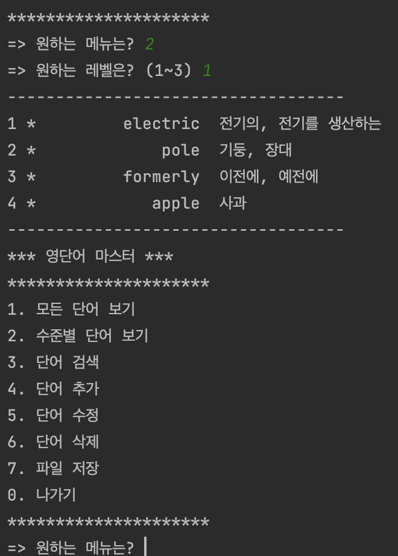
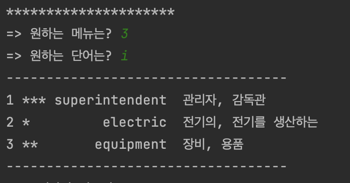
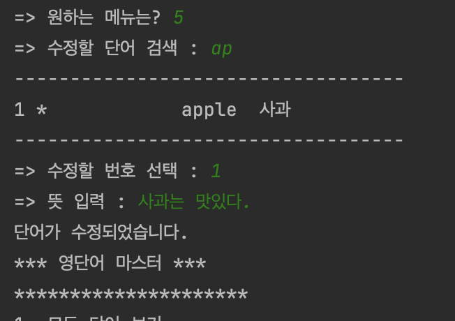
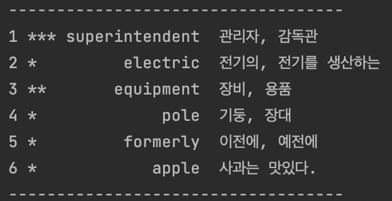
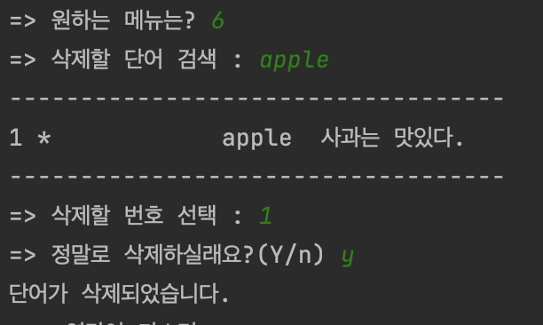
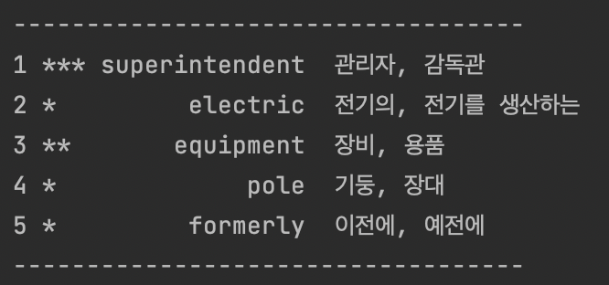
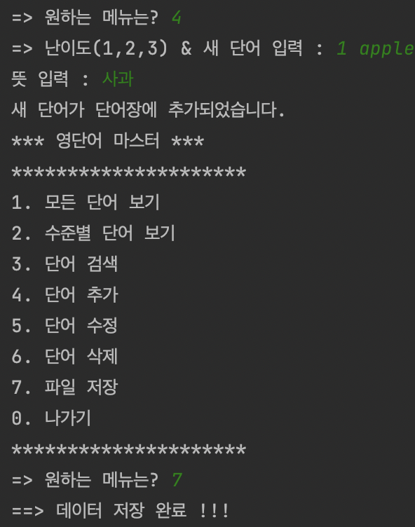
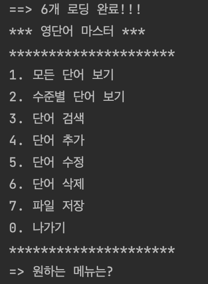
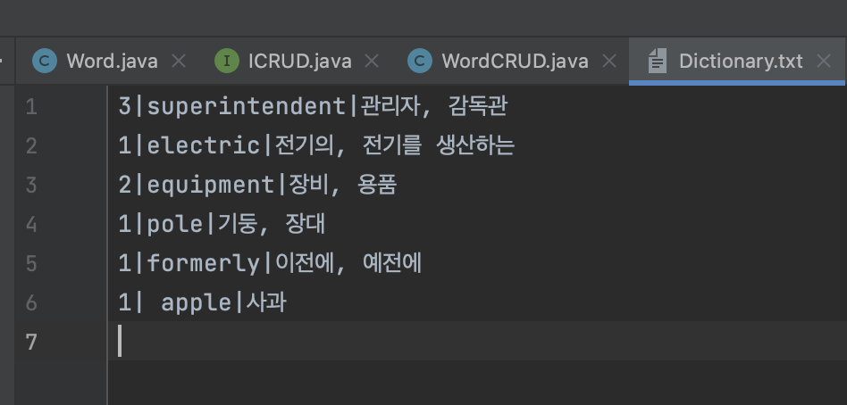

# CRUDproject

## 실행화면 보기

### [4. 단어 추가] 기능

### [1. 모든 단어 보기] 기능

### [0. 나가기] 기능

### [2. 수준별 단어 보기] 기능

### [3. 단어 검색] 기능

### [5. 단어 수정] 기능

### [6. 단어 삭제] 기능

### [7. 파일 저장] 기능

#### - 파일 내용

